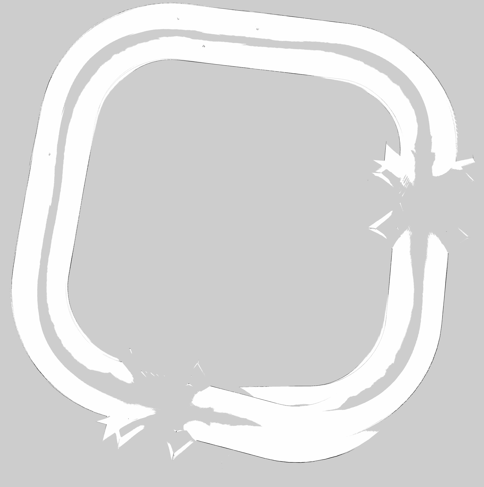

# Webots ROS2 Tesla SLAM

Webots ROS2 Tesla SLAM is a simulation package for running the Webots Tesla Model 3 with ROS 2, Cartographer SLAM, Navigation2, and RViz. It provides a ready-to-launch environment for testing autonomous driving workflows in simulation: Webots handles the vehicle and world, ROS 2 publishes the robot model and sensor data, Cartographer can build an occupancy map, and Nav2 can use the saved map for navigation. 

The package is based on the Cyberbotics Webots Tesla example and extends it with launch options, mapping/navigation configuration, RViz layouts, and a prepared map resource for repeatable SLAM and navigation experiments.

### Tesla

ROS 2 interface example for the simulated Webots Tesla Model 3. For details on the base Tesla model, refer to the [original documentation](https://github.com/cyberbotics/webots_ros2/wiki/Example-Tesla-Model-3).


## Features

* Webots Tesla Model 3 simulation with ROS 2 integration.
* Dedicated launch files for simulation, Cartographer SLAM, and Navigation2.
* Cartographer SLAM configuration for mapping the simulated world with front and rear lidars.
* Navigation2 configuration for map-based autonomous navigation.
* Selectable Navigation2 localization modes: GPS, AMCL, and odometry-only.
* GPS, IMU, NavSat relay, and dual-EKF localization support.
* Front/rear laser scan merger for AMCL localization.
* Twist-to-Ackermann bridge for the simulated vehicle controller.
* Prebuilt occupancy map for the default Tesla world.
* Dedicated RViz configurations for SLAM and Nav2 workflows.
* Simple lane-following node used when Nav2 is not enabled.

## Prerequisites

1. **Ubuntu 24.04** (Noble) or later
2. **ROS 2 Jazzy** (or Humble/Iron/Rolling)
3. **Python 3.10+**
4. **Webots R2023a** or later
5. **Colcon** build tool (`sudo apt install python3-colcon-common-extensions`)
6. **rosdep** (`sudo apt install python3-rosdep`)

## Installation

```bash
# Create ros2_ws and navigate to src directory
mkdir -p ~/ros2_ws/src && cd ~/ros2_ws/src

# Clone the webots_ros2 repository with submodules (--recursive)
git clone --recursive https://github.com/cyberbotics/webots_ros2.git

# Clone your modified Tesla SLAM package
git clone https://github.com/dmytro-varich/webots_ros2_tesla_slam.git

# Return to workspace root and install dependencies
cd ~/ros2_ws
rosdep install --from-paths src --ignore-src -r -y

# Build only your package (dependencies must be already in src/)
colcon build --symlink-install --packages-up-to webots_ros2_tesla_slam

# Source the workspace
source install/setup.bash
```

## Usage

### Launch Tesla in Webots

Use the following command to start the Tesla simulation in Webots:

```bash
ros2 launch webots_ros2_tesla_slam tesla_webots_launch.py
```

**Available parameters:**

| Parameter            | Default           | Description                                                                       |
| -------------------- | ----------------- | --------------------------------------------------------------------------------- |
| `world`              | `tesla_world.wbt` | Choose one of the world files from the `/webots_ros2_tesla_slam/worlds` directory |
| `use_sim_time`       | `true`            | Use simulation time if true                                                       |
| `lane_follower`      | `true`            | Launch the lane follower if true                                                  |
| `static_map_to_odom` | `false`           | Publish a static `map` to `odom` transform if true                                |

### Launch Cartographer SLAM

Use the following command to start Cartographer SLAM and RViz:

```bash
ros2 launch webots_ros2_tesla_slam slam_launch.py rviz:=true
```

**Available parameters:**

| Parameter       | Default           | Description                                                                       |
| --------------- | ----------------- | --------------------------------------------------------------------------------- |
| `world`         | `tesla_world.wbt` | Choose one of the world files from the `/webots_ros2_tesla_slam/worlds` directory |
| `use_sim_time`  | `true`            | Use simulation time if true                                                       |
| `rviz`          | `false`           | Launch RViz for SLAM if true                                                      |
| `launch_webots` | `true`            | Launch Webots Tesla with `lane_follower` enabled if true                          |

### Launch Navigation2

Use the following command to start Navigation2 with AMCL localization and RViz:

```bash
ros2 launch webots_ros2_tesla_slam navigation2_launch.py localization:=amcl rviz:=true
```

**Available parameters:**

| Parameter         | Default           | Description                                                                       |
| ----------------- | ----------------- | --------------------------------------------------------------------------------- |
| `world`           | `tesla_world.wbt` | Choose one of the world files from the `/webots_ros2_tesla_slam/worlds` directory |
| `use_sim_time`    | `true`            | Use simulation time if true                                                       |
| `map`             | `city_map.yaml`   | Full path to the map yaml file for Nav2                                           |
| `rviz`            | `false`           | Launch RViz for Navigation2 if true                                               |
| `launch_webots`   | `true`            | Launch Webots Tesla with `lane_follower` disabled if true                         |
| `localization`    | `amcl`             | Localization mode: `amcl`, `gps`, or `odom`                                       |

## Project Structure

```
webots_ros2_tesla_slam/
├── assets/                       # Images, videos, etc.
├── behavior_trees/
│   └── *.xml                     # Nav2 Behavior Tree XMLs. (used by `bt_navigator`)
├── config/
│   ├── cartographer.lua          # Cartographer SLAM configuration.
│   ├── dual_ekf_navsat.yaml      # GPS/NavSat dual-EKF localization configuration.
│   ├── nav2_params.yaml          # Navigation2 parameters.
│   ├── rviz_nav_config.rviz      # RViz layout for Nav2.
│   └── rviz_slam_config.rviz     # RViz layout for SLAM.
├── launch/
│   ├── navigation2_launch.py     # Navigation2 stack and optional RViz.
│   ├── slam_launch.py            # Cartographer SLAM and optional RViz.
│   └── tesla_webots_launch.py    # Webots Tesla simulation and driver.
├── maps/
│   ├── city_map.pgm              # Occupancy grid image for the default world.
│   ├── city_map_raw.pgm          # Raw occupancy grid image.
│   └── city_map.yaml             # Map metadata used by Nav2.
├── resource/
│   ├── tesla_webots.urdf         # Robot description used by ROS 2 and Webots.
│   └── webots_ros2_tesla_slam    # Ament package resource marker.
├── test/
│   └── test_copyright.py         # Package lint/test helper.
├── webots_ros2_tesla_slam/
│   ├── __init__.py
│   ├── cmd_vel_to_ackermann.py   # Nav2 Twist to AckermannDrive bridge.
│   ├── dual_laser_scan_merger.py # Front/rear LaserScan merger for AMCL.
│   ├── gps_navsat_relay.py       # Webots GPS NavSatFix relay for robot_localization.
│   ├── lane_follower.py          # Basic lane-following behavior.
│   └── tesla_driver.py           # Webots Tesla ROS 2 driver.
├── worlds/
│   └── tesla_world.wbt           # Default Webots world.
├── CHANGELOG.rst
├── LICENSE
├── package.xml                   # ROS 2 package metadata and dependencies.
├── setup.cfg
└── setup.py                      # Python package installation rules.
```

## Demonstration

https://github.com/user-attachments/assets/8209302e-43b1-4ced-9954-4f733328dd78

## Screenshots

<details>
<summary>🚗 Click to see Webots simulation</summary>

<div align="center">


*Webots simulation of the Tesla Model 3 showing LiDAR sensors (front and rear) and GPS, IMU mounted on top*

</div>

</details>

<details>
<summary>🗺️ Click to see Cartographer SLAM in RViz</summary>

<div align="center">


*RViz during Cartographer SLAM - real-time map building and robot pose estimation*

</div>

</details>

<details>
<summary>🗺️ Click to see raw Cartographer map output</summary>

<div align="center">



*Raw occupancy grid generated by Cartographer before post-processing*

</div>

</details>

<details>
<summary>🧹 Click to see post-processed map</summary>

<div align="center">


*Post-processed occupancy grid used by Navigation2*

</div>

</details>

<details>
<summary>🧭 Click to see RViz with Navigation2</summary>

<div align="center">


*Navigation2 stack in RViz - global and local planning, path following, and obstacle avoidance*

</div>

</details>

## License

This project is licensed under the **Apache License 2.0** - see the [LICENSE](LICENSE) file for details.

Code derived from [webots_ros2_tesla](https://github.com/cyberbotics/webots_ros2) also remains under **Apache 2.0**. See file headers for copyright details.
