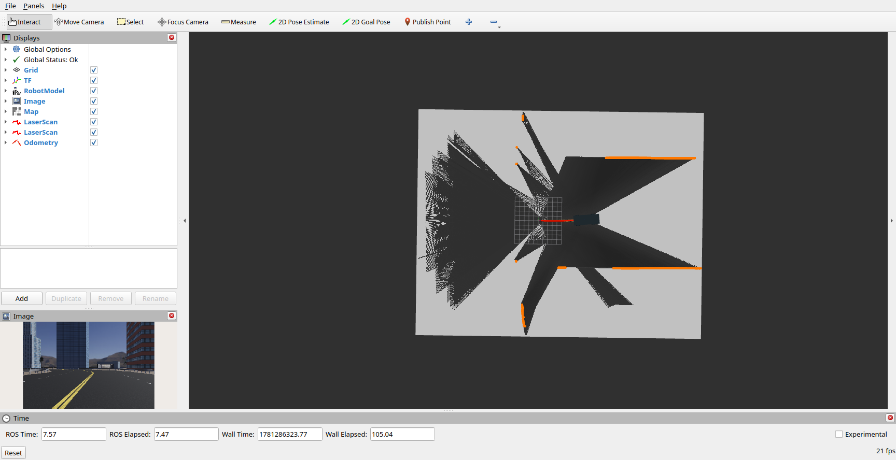
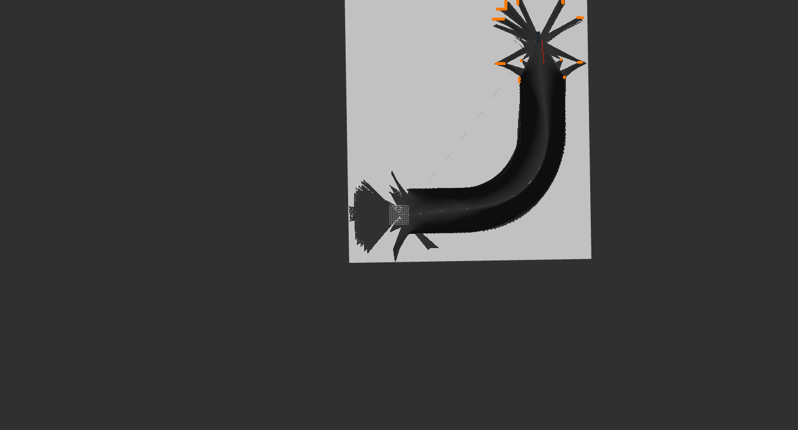
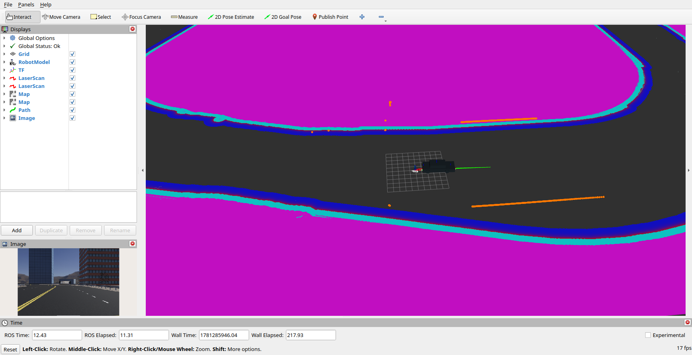

# Webots ROS2 Tesla SLAM

Webots ROS2 Tesla SLAM is a simulation package for running the Webots Tesla Model 3 with ROS 2, Cartographer SLAM, Navigation2, and RViz. It provides a ready-to-launch environment for testing autonomous driving workflows in simulation: Webots handles the vehicle and world, ROS 2 publishes the robot model and sensor data, Cartographer can build an occupancy map, and Nav2 can use the saved map for navigation.

The package is based on the Cyberbotics Webots Tesla example and extends it with launch options, mapping/navigation configuration, RViz layouts, and a prepared map resource for repeatable SLAM and navigation experiments.

### Tesla

ROS 2 interface example for the simulated Webots Tesla Model 3. For details on the base Tesla model, refer to the [original documentation](https://github.com/cyberbotics/webots_ros2/wiki/Example-Tesla-Model-3).


## Features

* Webots Tesla Model 3 simulation with ROS 2 integration.
* Single launch file for the vehicle, robot state publisher, Webots supervisor, and optional navigation stack.
* Cartographer SLAM configuration for mapping the simulated world.
* Navigation2 configuration for map-based autonomous navigation.
* Prebuilt occupancy map for the default Tesla world.
* Dedicated RViz configurations for SLAM and Nav2 workflows.
* Simple lane-following node used when Nav2 is not enabled.

## Prerequisites

1. **Ubuntu 24.04** (Noble) or later
2. **ROS 2 Jazzy** (or Humble/Iron/Rolling)
3. **Python 3.10+**
4. **Webots R2023a** or later
5. **Colcon** build tool (`sudo apt install python3-colcon-common-extensions`)
6. **rosdep** (`sudo apt install python3-rosdep`)

## Installation

```bash
# Create ros2_ws and navigate to src directory
mkdir -p ~/ros2_ws/src && cd ~/ros2_ws/src

# Clone the webots_ros2 repository with submodules (--recursive)
git clone --recursive https://github.com/cyberbotics/webots_ros2.git

# Clone your modified Tesla SLAM package
git clone https://github.com/dmytro-varich/webots_ros2_tesla_slam.git

# Return to workspace root and install dependencies
cd ~/ros2_ws
rosdep install --from-paths src --ignore-src -r -y

# Build only your package (dependencies must be already in src/)
colcon build --symlink-install --packages-up-to webots_ros2_tesla_slam

# Source the workspace
source install/setup.bash
```

## Usage

**Launch only Tesla in Webots:**
```bash
ros2 launch webots_ros2_tesla_slam tesla_webots_launch.py
```

**Launch Cartographer SLAM:**
```bash
ros2 launch webots_ros2_tesla_slam slam_launch.py rviz:=true
```
When Webots is launched by this file, RViz starts after the Tesla controller is connected.

**Launch Navigation2:**
```bash
ros2 launch webots_ros2_tesla_slam navigation2_launch.py rviz:=true
```
When Webots is launched by this file, RViz starts after the Tesla controller is connected.

**Compatibility launch file:**
```bash
ros2 launch webots_ros2_tesla_slam robot_launch.py slam:=true rviz_slam:=true
```

**Available parameters for `tesla_webots_launch.py`:**

| Parameter | Default | Description |
|-----------|---------|-------------|
| `world` | `tesla_world.wbt` | Choose one of the world files from `/webots_ros2_tesla_slam/worlds` directory |
| `use_sim_time` | `true` | Use simulation time if true |
| `lane_follower` | `true` | Launch the lane follower if true |
| `static_map_to_odom` | `false` | Publish a static `map` to `odom` transform if true |

**Available parameters for `slam_launch.py`:**

| Parameter | Default | Description |
|-----------|---------|-------------|
| `world` | `tesla_world.wbt` | Choose one of the world files from `/webots_ros2_tesla_slam/worlds` directory |
| `use_sim_time` | `true` | Use simulation time if true |
| `rviz` | `false` | Launch RViz for SLAM if true |
| `launch_webots` | `true` | Launch Webots Tesla with `lane_follower` enabled if true |

**Available parameters for `navigation2_launch.py`:**

| Parameter | Default | Description |
|-----------|---------|-------------|
| `world` | `tesla_world.wbt` | Choose one of the world files from `/webots_ros2_tesla_slam/worlds` directory |
| `use_sim_time` | `true` | Use simulation time if true |
| `map` | `city_map.yaml` | Full path to the map yaml file for Nav2 |
| `rviz` | `false` | Launch RViz for Navigation2 if true |
| `launch_webots` | `true` | Launch Webots Tesla with `lane_follower` disabled if true |

**Available parameters for `robot_launch.py`:**

| Parameter | Default | Description |
|-----------|---------|-------------|
| `world` | `tesla_world.wbt` | Choose one of the world files from `/webots_ros2_tesla_slam/worlds` directory |
| `nav` | `false` | Launch Navigation2 if true |
| `map` | `city_map.yaml` | Full path to the map yaml file for Nav2 |
| `slam` | `false` | Launch Cartographer SLAM if true |
| `rviz_nav` | `false` | Launch RViz for Navigation2 if true |
| `rviz_slam` | `false` | Launch RViz for SLAM if true |
| `use_sim_time` | `true` | Use simulation time if true |

## Project Structure

```
webots_ros2_tesla_slam/
├── assets/                       # Images, videos, etc.
├── behavior_trees/
│   └── *.xml                     # Nav2 Behavior Tree XMLs. (used by `bt_navigator`)
├── config/
│   ├── cartographer.lua          # Cartographer SLAM configuration.
│   ├── nav2_params.yaml          # Navigation2 parameters.
│   ├── rviz_nav_config.rviz      # RViz layout for Nav2.
│   └── rviz_slam_config.rviz     # RViz layout for SLAM.
├── launch/
│   ├── navigation2_launch.py     # Navigation2 stack and optional RViz.
│   ├── robot_launch.py           # Compatibility launch file.
│   ├── slam_launch.py            # Cartographer SLAM and optional RViz.
│   └── tesla_webots_launch.py    # Webots Tesla simulation and driver.
├── maps/
│   ├── city_map.pgm              # Occupancy grid image for the default world.
│   └── city_map.yaml             # Map metadata used by Nav2.
├── resource/
│   ├── tesla_webots.urdf         # Robot description used by ROS 2 and Webots.
│   └── webots_ros2_tesla_slam    # Ament package resource marker.
├── test/
│   └── test_copyright.py         # Package lint/test helper.
├── webots_ros2_tesla_slam/
│   ├── __init__.py
│   ├── lane_follower.py          # Basic lane-following behavior.
│   └── tesla_driver.py           # Webots Tesla ROS 2 driver.
├── worlds/
│   └── tesla_world.wbt           # Default Webots world.
├── CHANGELOG.rst
├── LICENSE
├── package.xml                   # ROS 2 package metadata and dependencies.
├── setup.cfg
└── setup.py                      # Python package installation rules.
```

## Screenshots

<details>
<summary>🚗 Click to see Webots simulation</summary>

<div align="center">


*Webots simulation of Tesla Model 3 showing LiDAR sensors (front and rear)*

</div>

</details>

<details>
<summary>🗺️ Click to see RViz while building map with Cartographer</summary>

<div align="center">



*RViz interface during SLAM mapping using Cartographer algorithm - real-time map building and robot pose estimation*

</div>

</details>

<details>
<summary>🗺️ Click to see generated occupancy map</summary>

<div align="center">



*Example of the occupancy grid map generated by Cartographer SLAM*

</div>

</details>

<details>
<summary>🧭 Click to see RViz with Navigation2</summary>

<div align="center">



*Navigation2 stack in RViz - global and local planning, path following, and obstacle avoidance*

</div>

</details>


## Licence

This project is licensed under the **MIT License** - see the [LICENSE](LICENSE) file for details.

### Third-party components

Code derived from [webots_ros2_tesla](https://github.com/cyberbotics/webots_ros2) remains under **Apache 2.0**. See file headers for copyright details.
